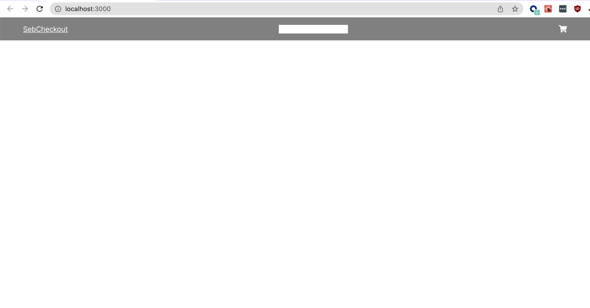
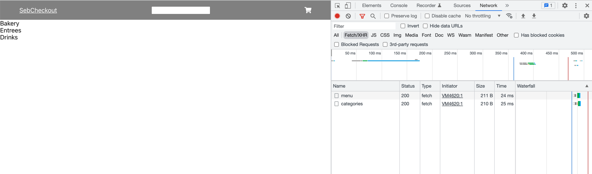
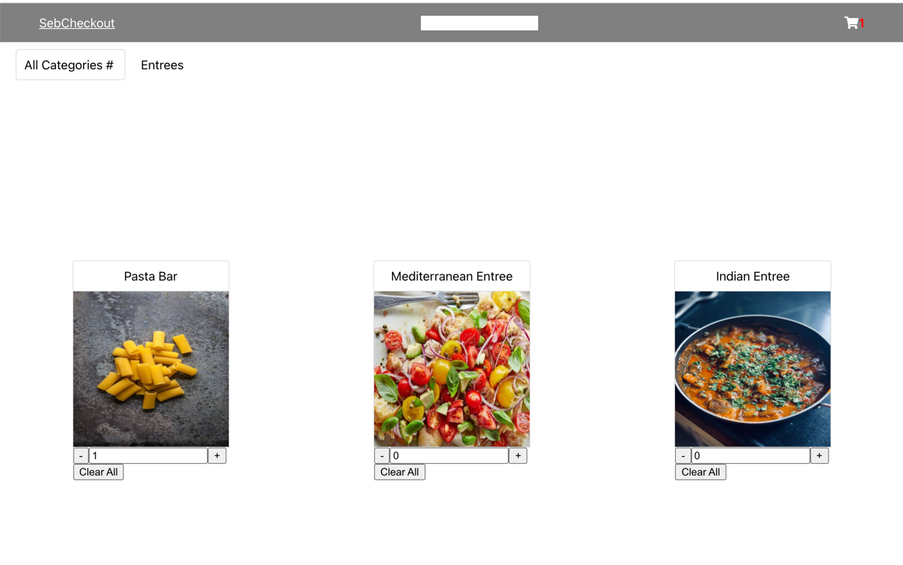

# 01-29-2022

I'll be starting with the UI today. 

## Thinking the design

I think a general basic UI were I picture a Catalogue page, a Cart page, a Payment Page and an Order page. This is what 
I want each page to show me:

### Catalogue: 
 Will have a top bar with a search bar and a link to the cart. The user will be abe to navigate and see 
 categories & items, as well as add and remove items to and from the cart
 
### Cart
 Will show the items added and will allow the user to add and remove items from it, as well as to show a sum of the total price

### Payment

Will only show 1 available payment option, others disabled. For simplicity the only one enabled will be cash and will call a mocked
`/pay` endpoint.

### Order

Will show the final result of the order with all its details. I might make a list of orders to show all previous ones, but I'll see how 
I'm doing with time first.

## Implementation

I will start with the Catalogue page and base all my other components from there. I will need these components in it

- Top Bar: Component with a logo, a search bar and link to cart (I'll see if I can make something fancy on a later iteration if I have time, but for now a link will suffice)
- SearchBar: search bar with a local filtering and simple search of items/categories, it wil not go and look for items on the "backend" for simplicity
- Cart link: a Cart link button
- Item/Category card: it will show a category or item, with its info and the ability to add the items in to the cart with a certain quantity and modify it

### Progress pics

1. Basic top bar
   
2. Requesting for info to server
   
3. Base item and category interaction (video on `../imgs/01-29-2022-progress-3.mov`)
4. Including option to add and remove items to cart 
   
5. View Cart
6. Perform Order